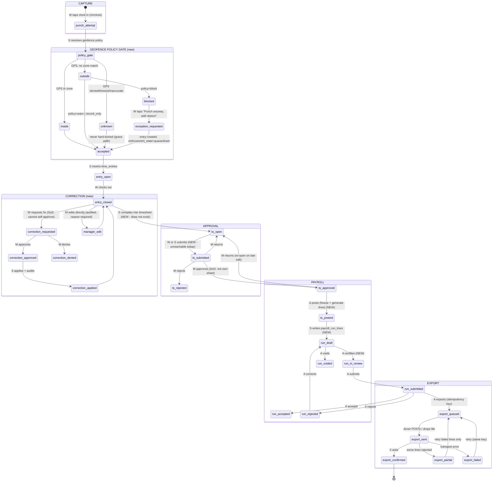

# COMPVSS Time Management — Complete Lifecycle Plan

Status: **Phases 0-3 landed; 4-7 outstanding.** Date: 2026-07-15. Scope: capture → geofence enforcement → correction/approval → payroll → external HR export.

**The lifecycle is now continuous end to end.** A punch is captured, policy-checked, correctable under review, compiled into a timesheet, submitted, approved, posted to a payroll run, and split into earning-coded lines that trace back to the punches behind them. §0's hollow middle is closed. What remains is the *outward* half: the open surface (Phase 4) and the connectors on top of it (5-6).

## Landed

| Phase | Commit | What shipped |
| --- | --- | --- |
| 0 — defect sweep | `abc5e665` | All 10 items. Zero-zone → `unknown` (this had to land first: `block` on a zone-less org would lock out every worker), containment-beats-proximity attribution, `decideTimesheet` last-write-wins race + claim-before-audit ordering, self-approval of own timesheet, unverifiable `as_manager`, two unguarded mutations, the dead `ticket.scanned` event (one shared registry now), the payroll `[runId]` 404, `duration_minutes` trigger contract, and guard tests for both duplicated lists (each verified to fail on the reintroduced defect). |
| 1 — geofence policy | `7783e243` | `block`/`warn`/`record_only` resolving zone → org → `record_only` (the default, so no existing org changed). Migrations `20260715150000` + `20260715150100`. 422 (not 409 — the outbox drops 409 as a dedupe). Accuracy capture + gate, departure GPS, grace radius, `enforcement_state` ledger. Proven live: outside → 422 with distance/nearest-zone/override, inside → clean, override → quarantined, 900 m fix → quarantined `low_accuracy`. |
| 2 — corrections + audit | `2ddc53dc`, `584dc09c` | `time_entry_corrections` FSM, the `tg_audit_time_entry` **trigger** (proven to fire on raw psql with zero app code), posted-sheet freeze, `apply_time_correction` RPC (one transaction; rolls back whole against a posted sheet). SoD enforced at route + RLS + DB CHECK. `time:read`/`time:approve`/`time:edit`; `collaborator` narrowed off `time:*`. OpenAPI documented. |

| 3 — **the spine** | `4ac11487` | The §0 hollow middle, closed. `pay_periods` + `compile_timesheets` (idempotent by construction, so late offline replays re-run safely) + `recompute_timesheet_totals` with a live trigger (an applied correction or replayed punch re-rolls the sheet; posting freezes it) + `POST /timesheets/{id}/submit` (the lifecycle was unreachable from `open`) + `post_timesheet` (admin band, `approved`-gated, re-post replaces rather than double-pays) + earning codes + `hr_worker_links` + `source_entry_ids` lineage. Overtime: **`flsa` and `ca` only**, everything else must use `none` — see `src/lib/time/overtime.ts` for the limits of even those two. Verified live: rollup 14h, late punch 14h→16h, posted totals frozen. |

**Remaining: Phases 4-7.** Phase 4 (open surface: OpenAPI registry, `API_SCOPES`, webhook events, Zapier, dev docs) is next and gates 5-6 — the rule that a native connector may do nothing an external integrator can't. Phase 6 (ADP et al.) is gated on partnership/certification and Phase 7c (background geofencing) on a native shell release and Play/App Store review; **neither is closable by engineering effort alone.**

### Carried forward from building this

- `payroll_run_lines` was never empty — it holds 6 demo rows seeded 2026-06-24. The accurate statement is that **no application code wrote it** until `post_timesheet`; the exporters were rendering seed data.
- `database.types.ts` is `.prettierignore`d generator-owned output. Never run prettier on it, and never trust the working tree's copy: verify a commit in an isolated worktree, because a concurrent session's uncommitted regen will mask a missing type (this shipped a broken `main` once — `584dc09c`).

---


Every current-state claim below cites a file/route. Where a capability is absent, this document says so plainly rather than describing intent as implementation.

---

## 0. The finding that reframes this plan

The brief assumed the chain is `capture → approve → payroll → export` and that the missing piece is an ADP connector. It isn't. **The middle of the lifecycle does not exist.**

| Link | Reality | Evidence |
| --- | --- | --- |
| Punch → timesheet | `time_entries.timesheet_id` column exists, **nothing ever writes it** | Column: `supabase/migrations/20260606230000_baseline.sql:9364`. Only `timesheet_id` writes in `src/` target `timesheet_approvals` (`src/app/(platform)/studio/finance/timesheets/[id]/actions.ts:69`) |
| Timesheet creation | **No code inserts a `timesheets` row.** Every `from("timesheets")` call is a read except a state-only update | `src/app/(platform)/studio/finance/timesheets/[id]/actions.ts:78` is the sole write |
| Hours rollup | `timesheets.total_minutes` / `billable_minutes` are static `integer DEFAULT 0` columns. No trigger, no function, no app code aggregates entries into them | `baseline.sql:15689-15690` |
| `open → submitted` | `ALLOWED_DECISIONS.open = []` and nothing submits. The lifecycle is **unreachable from its own initial state** | `src/lib/db/timesheets.ts:60-67` |
| Timesheet → payroll lines | **Nothing writes `payroll_run_lines`.** Both exporters `.select()` an unpopulated table | `src/app/api/v1/payroll-runs/[runId]/state-xml/route.ts:60`, `.../pdf/route.tsx:65` |
| Payroll run lifecycle | `run_state` is only ever written as `"draft"`. No certify, submit, or void path exists | `src/app/(platform)/studio/finance/payroll/new/actions.ts:67`; zero other writers |
| External HR/payroll | **None.** One marketplace tile with `available: false` | `src/app/(platform)/studio/settings/integrations/marketplace/page.tsx:47` |

**Consequence:** an ADP connector built today would export an empty table. The compile/submit/post spine (Phase 3) is the prerequisite for every export ambition, and it is the single highest-value item in this plan. Item 5 of the brief cannot be delivered before it.

The portal already promises the pipeline to workers: *"Once a pay period is compiled and submitted, it shows here with its review state."* (`src/app/(portal)/p/[slug]/crew/timesheets/page.tsx:68-72`). Nothing compiles and nothing submits.

---

## (a) Lifecycle state diagram

Actors: **W** worker/crew · **M** manager · **A** admin/controller · **S** system/server · **X** external system.



**Locking rule threaded through the diagram:** once a timesheet reaches `posted`, its `time_entries` are frozen. A manager edit or approved correction targeting a posted sheet is **rejected at the database trigger**, not the application layer. Editing an `approved` (not yet posted) sheet forces it back to `open` and voids the prior approval.

---

## (b) Current-state table

Extends the verified baseline. **Status vocabulary:** ✅ present and enforced · 🟡 present but partial/unenforced · ❌ absent · 🐞 present and defective.

### Capture

| Capability | Status | Evidence |
| --- | --- | --- |
| Personal clock in/out | ✅ | `/m/clock`, `/m/punch` → `src/components/mobile/useClockPunch.ts` → `POST /api/v1/time/clock` |
| Offline punch queue + replay | ✅ | `postFieldWrite` (`src/lib/offline/outbox.ts:156-187`); SW queue `public/service-worker.js:24-32` |
| True capture time on replay | ✅ | `at` stamped client-side (`useClockPunch.ts:88`); 15-min future clamp (`time/clock/route.ts:41-43`) |
| GPS capture on **clock in** | ✅ | Best-effort ≤4.5s, never blocks (`useClockPunch.ts:44-72`) |
| GPS capture on **clock out** | ❌ | `const pos = action === "clock_in" ? await getPosition() : null` — `useClockPunch.ts:88`. **No departure geofence data exists.** Blocks brief item 2's exit detection |
| GPS **accuracy** capture | ❌ | `coords.accuracy` read nowhere; `PostSchema` accepts only `lat`/`lng` (`time/clock/route.ts:23-28`). No accuracy threshold is possible today |
| Zone classification | ✅ | `classifyPunch` / `metersBetween` (`src/lib/workforce.ts:16-35`) |
| Zone match = **nearest** | 🐞 | Comment says "nearest active zone" but the loop is first-inside-wins in arbitrary DB order (`shifts/checkin/route.ts:110-147`; same in `time/clock/route.ts:75-93`). Overlapping zones attribute nondeterministically |
| Zero-zone org handling | 🐞 | Org with **no** configured zones tags every GPS punch `outside` (`time/clock/route.ts:92`, `shifts/checkin/route.ts:146`) because the fallback keys on "didn't land inside" not "had a zone to compare". `classifyPunch`'s own null-zone contract returns `unknown` (`workforce.ts:31`). **Enabling `block` before fixing this locks out every zone-less org.** |
| RBAC on `/time/clock` | ✅ | `assertCapability(session, "time:write")` (`time/clock/route.ts:53`) |
| RBAC on `/shifts/checkin` | 🐞 | `withAuth` only — **no capability assert** (`shifts/checkin/route.ts:52`), despite `time:write` / `check-in:*` existing |
| Shift T&A FSM | ✅ | `REQUIRED_FROM` + state-predicated UPDATE (`shifts/checkin/route.ts:32-40`, `:98`) |
| Shift notes | 🐞 | `as_manager` is **caller-supplied and never verified** — any member posts a manager-badged note (`/m/clock/actions.ts:21-53`; rendered `page.tsx:184`). Re-scope is org-wide, so any member annotates any colleague's entry |
| Zones admin | ✅ | `/studio/settings/time-clock-zones`; DDL `baseline.sql:15613-15627` (has `project_id`, radius 25-5000m) |

### Geofence enforcement

| Capability | Status | Evidence |
| --- | --- | --- |
| Geofence **recorded** | ✅ | `geofence_state` + `zone_id` + `punch_lat/lng` on `time_entries` (`baseline.sql:9365-9370`) |
| Geofence **enforced** | ❌ | Explicit: *"The geofence classification is informational — we don't block `check_in` on an outside-the-zone punch"* (`shifts/checkin/route.ts:8-17`) |
| Per-zone / per-org policy | ❌ | No policy column on `time_clock_zones` or org settings |
| Accuracy threshold | ❌ | Accuracy never captured (above) |
| Mock-location detection | ❌ | Not possible in the webview. See §Spoofing |

### Push / arrival-departure

| Capability | Status | Evidence |
| --- | --- | --- |
| Push infrastructure | ✅ | `sendPushTo` / `sendPushBulk` (`src/lib/push/send.ts:402`, `:439`) |
| Per-kind opt-out | 🟡 | Works for direct `sendPush*` callers (`send.ts:311-332`), but **`notify()` passes no `kind`**, so `filterByPushPrefs` short-circuits (`notify.ts:86-96` → `send.ts:318`). The `/m/settings/notifications` matrix does not gate `notify()` pushes |
| Local notifications | ✅ (unused for time) | `@capacitor/local-notifications` installed (`package.json`) |
| Background geofence enter/exit | ❌ | **No plugin installed.** Only camera, geolocation, local-notifications, push-notifications. No `watchPosition` anywhere. See §Native assessment |
| Zone ↔ shift link | ❌ | Zones carry `project_id` (`baseline.sql:15616`); shifts carry `venue_id` (`shifts/checkin/route.ts:107-109`: *"shifts.venue_id maps to a venue, not a project"*). **No join exists**, so a nudge cannot know the worker has a shift *at that zone* |

### Correction & approval

| Capability | Status | Evidence |
| --- | --- | --- |
| Crew self-correction | ❌ | Crew portal is strictly read-only, no forms/actions (`p/[slug]/crew/timesheets/page.tsx:13-18`). No `/m` timesheet surface at all |
| Manager punch edit | ❌ | No UI or action edits `time_entries`. Only inserts (checkin/clock) and the close-out update |
| Punch-level audit trail | ❌ | No `time_entry` audit table. `shift_notes` is freeform commentary, not before/after audit |
| Timesheet approval | ✅ | `decideTimesheet` + append-only `timesheet_approvals` (`timesheets/[id]/actions.ts:21-87`) |
| Approval transition guard | ✅ | `canDecide` / `ALLOWED_DECISIONS` (`src/lib/db/timesheets.ts:60-71`) |
| Approval concurrency | 🐞 | `decideTimesheet`'s UPDATE is **not predicated** on the validated state (`actions.ts:78-82`). Two concurrent decisions both pass `canDecide` on a stale read; last write wins. This is the exact race `workforce.ts:44-48` warns against, and which `shifts/checkin` gets right (`:98`) |
| Approval list RBAC | 🟡 | List has **no `isManagerPlus` gate** (`timesheets/page.tsx:39-55`); relies on RLS `utt_ts_party` (`baseline.sql:40126`). Members see a manager-framed table of their own sheets |
| SoD: approve own sheet | ❌ | Nothing prevents a manager approving their own timesheet |
| Generic approvals engine | ✅ (unused here) | `routeToApprovals` (`src/lib/approvals/route.ts:20-93`); `timesheets.approval_instance_id` exists and is **dormant** (`baseline.sql:15691`). Timesheets hand-roll a parallel engine |

### Payroll & export

| Capability | Status | Evidence |
| --- | --- | --- |
| Compile entries → timesheet | ❌ | See §0 |
| Hours rollup | ❌ | See §0 |
| Submit / post | ❌ | See §0 |
| OT calculation | ❌ | No FLSA/state OT logic anywhere |
| Earning codes | ❌ | No table, no mapping |
| Payroll run create | 🟡 | Inserts `draft` only; **no capability or manager gate** (`payroll/new/actions.ts:34-77`) |
| Payroll run detail page | 🐞 | Action redirects to `/studio/finance/payroll/${id}` (`actions.ts:75`) — **the route does not exist**. Live 404 after every run creation |
| Certified payroll XML | 🟡 | CA DIR / NY PWA / WA L&I render (`src/lib/payroll/state-xml.ts:163-174`), but `fein`, `license_number`, `address` are never populated (`state-xml/route.ts:108`) — exports ship empty statutory identifiers |
| WH-347 PDF | ✅ | `/api/v1/payroll-runs/[runId]/pdf` |
| External HR/payroll | ❌ | See §0 |

### Integration surface

| Capability | Status | Evidence |
| --- | --- | --- |
| OpenAPI YAML (SSOT) | ✅ | `docs/api/openapi.yaml`; drift-guarded (`src/app/api/openapi-drift.test.ts:178`, `:193`) |
| Served spec `/api/v1/openapi.json` | 🐞 | A **route handler** built from `src/lib/openapi/all-endpoints.ts` registering **22 endpoints**. Nothing validates it against disk or the YAML — `api-canon.test.ts:97-98` merely exempts it. Third parties fetching the machine-readable spec see **no time or payroll surface at all** |
| Time paths in YAML | 🟡 | `/api/v1/time/clock` documented (`openapi.yaml:1535`); payroll PDF/XML documented (`:2299`, `:2313`). **No timesheet paths exist** |
| Webhook delivery | ✅ | HMAC `t=<ts>,v1=<hex>` over `${ts}.${body}` (`src/lib/webhooks/deliver.ts:58-72`) |
| Webhook event registry | 🐞 | **Two lists that have drifted.** Subscribable: `webhooks/endpoints/route.ts:15-32`. Emittable: `notify.ts:30-48`. `ticket.scanned` is subscribable but **can never fire** (emitter says `assignment.scanned`); `offer_letter.*` and `marketplace.inquiry_received` fire but can't be subscribed individually |
| Zapier triggers/actions | ✅ | 4 triggers + 2 actions under `src/app/api/v1/zapier/**` |
| Zapier registration | ❌ (external) | **No manifest in-repo.** The app definition lives in Zapier's platform and hardcodes URLs. Adding a route here is invisible to Zapier until the external app is edited |
| PAT minting + auth | ✅ | `mintToken` (`src/lib/api-keys.ts:50-59`); constant-time verify (`:94-98`); soft-deleted membership blocked (`:100-111`) |
| PAT scope vocabulary | 🐞 | **No enum, no list, no type.** `scopes: z.array(z.string().max(64))` (`api-keys/route.ts:22-26`) — a typo mints successfully and grants nothing. **A token minted with no scopes is a wildcard** (`api-keys/route.ts:68` → `auth.ts:512`) |
| Capability matrix | ✅ | Inline `auth.ts:355-374` (role) + `:387-434` (persona). **No `time:approve` capability exists** — `time:*` / `time:write` have no notion of approval authority |
| Automations | ✅ | `emitDomainEvent` (`src/lib/automations/dispatch.ts:28-34`), `eventType: string` — untyped, no registry |

---

## (c) Data-model changes

Nine migrations. LDP-compliant (`*_state` / `*_phase`; no bare `status`). Every new table: `org_id` + RLS via `private.is_org_member` / `has_org_role`, `touch_updated_at` trigger.

### C1 — Capture fidelity (prerequisite for everything in §1 and §2)

`20260716120000_time_capture_fidelity.sql`

```sql
ALTER TABLE public.time_entries
  ADD COLUMN punch_accuracy_m double precision,
  ADD COLUMN punch_out_lat double precision,
  ADD COLUMN punch_out_lng double precision,
  ADD COLUMN punch_out_accuracy_m double precision,
  ADD COLUMN geofence_out_state text
    CHECK (geofence_out_state = ANY (ARRAY['inside','outside','unknown'])),
  ADD COLUMN zone_out_id uuid REFERENCES public.time_clock_zones(id),
  ADD COLUMN enforcement_state text NOT NULL DEFAULT 'clean'
    CHECK (enforcement_state = ANY (ARRAY['clean','warned','quarantined','overridden'])),
  ADD COLUMN enforcement_reason text,
  ADD COLUMN source_channel text NOT NULL DEFAULT 'app'
    CHECK (source_channel = ANY (ARRAY['app','offline_replay','manager_entry','correction','import')));

CREATE INDEX ON public.time_entries (org_id, enforcement_state)
  WHERE enforcement_state <> 'clean';
```

`enforcement_state` is the exception ledger: `quarantined` = accepted but requires manager review (the offline/GPS-denied path); `overridden` = a manager cleared it. Note `duration_minutes` must **not** be set explicitly when `ended_at` is present — the `tg_compute_time_entry_duration` trigger owns it (`baseline.sql:5056`), and `time/clock/route.ts:110` currently violates that contract by computing it in app code. Fold that into this migration's cleanup.

### C2 — Geofence policy

`20260716120100_geofence_policy.sql`

```sql
ALTER TABLE public.time_clock_zones
  ADD COLUMN geofence_policy text
    CHECK (geofence_policy = ANY (ARRAY['block','warn','record_only'])),
  ADD COLUMN accuracy_threshold_m integer CHECK (accuracy_threshold_m BETWEEN 10 AND 1000),
  ADD COLUMN grace_radius_m integer CHECK (grace_radius_m BETWEEN 0 AND 2000);

CREATE TABLE public.org_time_settings (
  org_id uuid PRIMARY KEY REFERENCES public.orgs(id) ON DELETE CASCADE,
  geofence_policy text NOT NULL DEFAULT 'record_only'
    CHECK (geofence_policy = ANY (ARRAY['block','warn','record_only'])),
  accuracy_threshold_m integer NOT NULL DEFAULT 100,
  grace_radius_m integer NOT NULL DEFAULT 50,
  allow_offline_punch_when_blocking boolean NOT NULL DEFAULT true,
  pay_period_kind text NOT NULL DEFAULT 'weekly'
    CHECK (pay_period_kind = ANY (ARRAY['weekly','biweekly','semimonthly','monthly'])),
  pay_period_anchor date NOT NULL DEFAULT '2026-01-04',
  ot_rule_set text NOT NULL DEFAULT 'flsa'
    CHECK (ot_rule_set = ANY (ARRAY['flsa','ca','none'])),
  created_at timestamptz NOT NULL DEFAULT now(),
  updated_at timestamptz NOT NULL DEFAULT now()
);
```

Zone columns are **nullable on purpose**: `NULL` = inherit org. Resolution: zone → org → `'record_only'`. The default preserves today's informational behavior exactly, so the migration is a no-op behaviorally.

### C3 — Zone ↔ shift link (unblocks schedule-aware nudges)

`20260716120200_zone_shift_link.sql`

```sql
ALTER TABLE public.time_clock_zones ADD COLUMN venue_id uuid REFERENCES public.venues(id);
CREATE INDEX ON public.time_clock_zones (org_id, venue_id) WHERE deleted_at IS NULL;
```

Zones carry `project_id`; shifts carry `venue_id`. Bridging on `venue_id` is the smaller change and matches how shifts actually resolve location. Without this, §2's "only nudge when they have a shift here" is not expressible.

### C4 — Punch audit (append-only, trigger-enforced)

`20260716120300_time_entry_audit.sql`

```sql
CREATE TABLE public.time_entry_audit (
  id uuid PRIMARY KEY DEFAULT gen_random_uuid(),
  org_id uuid NOT NULL REFERENCES public.orgs(id) ON DELETE CASCADE,
  time_entry_id uuid NOT NULL,           -- deliberately no FK: audit survives deletion
  actor_id uuid,                          -- null = system/trigger
  audit_action text NOT NULL CHECK (audit_action = ANY (ARRAY['insert','update','delete'])),
  before_row jsonb,
  after_row jsonb,
  changed_fields text[],
  reason text,
  occurred_at timestamptz NOT NULL DEFAULT now()
);
ALTER TABLE public.time_entry_audit ENABLE ROW LEVEL SECURITY;
CREATE POLICY tea_read ON public.time_entry_audit FOR SELECT
  USING (private.is_org_member(org_id));
-- No INSERT/UPDATE/DELETE policy: only the SECURITY DEFINER trigger writes.
```

Captured by a **trigger**, not application code:

```sql
CREATE OR REPLACE FUNCTION public.tg_audit_time_entry() RETURNS trigger
  LANGUAGE plpgsql SECURITY DEFINER SET search_path TO 'public','pg_temp' AS $$
DECLARE v_reason text := current_setting('app.edit_reason', true);
BEGIN
  INSERT INTO public.time_entry_audit (org_id, time_entry_id, actor_id, audit_action,
    before_row, after_row, changed_fields, reason)
  VALUES (COALESCE(NEW.org_id, OLD.org_id), COALESCE(NEW.id, OLD.id), auth.uid(),
    lower(TG_OP), to_jsonb(OLD), to_jsonb(NEW),
    CASE WHEN TG_OP = 'UPDATE' THEN ARRAY(
      SELECT key FROM jsonb_each(to_jsonb(NEW))
      WHERE to_jsonb(NEW) -> key IS DISTINCT FROM to_jsonb(OLD) -> key) END,
    NULLIF(v_reason, ''));
  RETURN COALESCE(NEW, OLD);
END; $$;
```

**Why a trigger and not app code:** it cannot be bypassed by any path — the correction applier, a future import, an admin running raw SQL, or a code path someone adds next year. For a payroll-grade audit trail that is the difference between "we log edits" and "edits are logged." Reason travels via the `app.edit_reason` GUC set by the RPC in C5.

### C5 — Posted-sheet lock

Same migration. A `BEFORE UPDATE OR DELETE` trigger rejecting mutation of entries on a posted sheet:

```sql
CREATE OR REPLACE FUNCTION public.tg_guard_posted_time_entry() RETURNS trigger
  LANGUAGE plpgsql SET search_path TO 'public','pg_temp' AS $$
DECLARE v_state public.utt_timesheet_state;
BEGIN
  IF OLD.timesheet_id IS NULL THEN RETURN COALESCE(NEW, OLD); END IF;
  SELECT state INTO v_state FROM public.timesheets WHERE id = OLD.timesheet_id;
  IF v_state IN ('posted','archived') THEN
    RAISE EXCEPTION 'time entry % belongs to a % timesheet and is frozen', OLD.id, v_state
      USING ERRCODE = '42501';
  END IF;
  RETURN COALESCE(NEW, OLD);
END; $$;
```

Editing an `approved` (not posted) sheet is allowed but forces `approved → open` and voids the approval — handled in the C6 applier, not here.

### C6 — Corrections

`20260716120400_time_entry_corrections.sql`

```sql
CREATE TABLE public.time_entry_corrections (
  id uuid PRIMARY KEY DEFAULT gen_random_uuid(),
  org_id uuid NOT NULL REFERENCES public.orgs(id) ON DELETE CASCADE,
  time_entry_id uuid REFERENCES public.time_entries(id) ON DELETE CASCADE, -- null = missing punch
  timesheet_id uuid REFERENCES public.timesheets(id) ON DELETE SET NULL,
  requester_id uuid NOT NULL REFERENCES auth.users(id),
  correction_kind text NOT NULL CHECK (correction_kind = ANY (ARRAY[
    'edit_in','edit_out','edit_both','missing_entry','delete_entry','zone_override'])),
  original_started_at timestamptz,
  original_ended_at timestamptz,
  proposed_started_at timestamptz,
  proposed_ended_at timestamptz,
  proposed_zone_id uuid REFERENCES public.time_clock_zones(id),
  reason text NOT NULL CHECK (length(btrim(reason)) >= 10),
  correction_state text NOT NULL DEFAULT 'requested'
    CHECK (correction_state = ANY (ARRAY['requested','approved','denied','applied','withdrawn'])),
  decided_by uuid REFERENCES auth.users(id),
  decided_at timestamptz,
  decision_notes text,
  applied_at timestamptz,
  approval_instance_id uuid REFERENCES public.approval_instances(id),
  created_at timestamptz NOT NULL DEFAULT now(),
  updated_at timestamptz NOT NULL DEFAULT now(),

  -- Separation of duties, enforced in the schema, not just the app.
  CONSTRAINT tec_no_self_approval CHECK (decided_by IS NULL OR decided_by <> requester_id),
  CONSTRAINT tec_missing_entry_shape CHECK (
    (correction_kind = 'missing_entry' AND time_entry_id IS NULL AND proposed_started_at IS NOT NULL)
    OR (correction_kind <> 'missing_entry' AND time_entry_id IS NOT NULL))
);

CREATE UNIQUE INDEX tec_one_open_per_entry ON public.time_entry_corrections (time_entry_id)
  WHERE correction_state = 'requested' AND time_entry_id IS NOT NULL;
```

`tec_no_self_approval` is the load-bearing line: a worker cannot approve their own request even if a bug, a compromised manager session, or a future code path tries. The partial unique index prevents request spam against one entry.

RLS:

```sql
-- Worker: request own only.
CREATE POLICY tec_insert_self ON public.time_entry_corrections FOR INSERT
  WITH CHECK (private.is_org_member(org_id) AND requester_id = auth.uid()
              AND correction_state = 'requested');
-- Worker reads own; manager+ reads all in org.
CREATE POLICY tec_read ON public.time_entry_corrections FOR SELECT
  USING (private.is_org_member(org_id)
         AND (requester_id = auth.uid() OR private.has_org_role(org_id, ARRAY['owner','admin','manager'])));
-- Only manager+ decides. Worker withdrawal is a separate narrow policy.
CREATE POLICY tec_decide ON public.time_entry_corrections FOR UPDATE
  USING (private.has_org_role(org_id, ARRAY['owner','admin','manager']))
  WITH CHECK (private.has_org_role(org_id, ARRAY['owner','admin','manager']));
```

`approval_instance_id` mirrors the dormant `timesheets.approval_instance_id` pattern. **Recommendation:** ship v1 with the local FSM (simple, matches `timesheet_approvals`), and treat `routeToApprovals` adoption as a later consolidation — routing a single-step edit request through a 5-routing-kind engine is over-engineering for the first release, and the column keeps the door open.

### C7 — The spine: pay periods, rollup, submit

`20260716120500_timesheet_spine.sql`

```sql
CREATE TABLE public.pay_periods (
  id uuid PRIMARY KEY DEFAULT gen_random_uuid(),
  org_id uuid NOT NULL REFERENCES public.orgs(id) ON DELETE CASCADE,
  period_start date NOT NULL,
  period_end date NOT NULL,
  period_state text NOT NULL DEFAULT 'open'
    CHECK (period_state = ANY (ARRAY['open','locked','posted'])),
  created_at timestamptz NOT NULL DEFAULT now(),
  updated_at timestamptz NOT NULL DEFAULT now(),
  UNIQUE (org_id, period_start, period_end),
  CONSTRAINT pp_range CHECK (period_end >= period_start)
);

ALTER TABLE public.timesheets
  ADD COLUMN pay_period_id uuid REFERENCES public.pay_periods(id),
  ADD COLUMN submitted_at timestamptz,
  ADD COLUMN submitted_by uuid REFERENCES auth.users(id),
  ADD COLUMN posted_at timestamptz,
  ADD COLUMN posted_by uuid REFERENCES auth.users(id),
  ADD COLUMN compiled_at timestamptz;

CREATE UNIQUE INDEX ts_one_per_party_period ON public.timesheets (org_id, party_id, pay_period_id)
  WHERE pay_period_id IS NOT NULL;
```

The rollup is a **derived function, never a trusted column** — the current defect is that `total_minutes` is a static integer the app never computes:

```sql
CREATE OR REPLACE FUNCTION public.recompute_timesheet_totals(p_timesheet_id uuid)
  RETURNS void LANGUAGE plpgsql SECURITY DEFINER SET search_path TO 'public','pg_temp' AS $$
BEGIN
  UPDATE public.timesheets t SET
    total_minutes = COALESCE(agg.total, 0),
    billable_minutes = COALESCE(agg.billable, 0),
    updated_at = now()
  FROM (SELECT COALESCE(SUM(duration_minutes), 0) AS total,
               COALESCE(SUM(duration_minutes) FILTER (WHERE billable), 0) AS billable
        FROM public.time_entries
        WHERE timesheet_id = p_timesheet_id AND ended_at IS NOT NULL) agg
  WHERE t.id = p_timesheet_id AND t.state NOT IN ('posted','archived');
END; $$;
```

Plus `ALLOWED_DECISIONS.open` gains `["submitted"]` semantics via a new `submitTimesheet` path — today `open: []` makes the lifecycle unreachable from its initial state (`src/lib/db/timesheets.ts:61`).

**Compile** is an idempotent RPC (`compile_timesheets(org_id, pay_period_id)`): for each party with closed entries in the window, upsert one `timesheets` row on the unique index and stamp `time_entries.timesheet_id`. Idempotent by construction; re-runnable as entries land late from the offline queue. Only touches sheets in `open`.

### C8 — Earning codes + payroll lines

`20260716120600_payroll_earning_codes.sql`

```sql
CREATE TABLE public.earning_codes (
  id uuid PRIMARY KEY DEFAULT gen_random_uuid(),
  org_id uuid NOT NULL REFERENCES public.orgs(id) ON DELETE CASCADE,
  code text NOT NULL,                    -- 'REG','OT','DT','PTO','SICK'
  label text NOT NULL,
  multiplier numeric(4,2) NOT NULL DEFAULT 1.0,
  is_worked_time boolean NOT NULL DEFAULT true,
  lifecycle_state text NOT NULL DEFAULT 'active'
    CHECK (lifecycle_state = ANY (ARRAY['active','inactive','archived'])),
  UNIQUE (org_id, code)
);

CREATE TABLE public.hr_worker_links (
  id uuid PRIMARY KEY DEFAULT gen_random_uuid(),
  org_id uuid NOT NULL REFERENCES public.orgs(id) ON DELETE CASCADE,
  party_id uuid NOT NULL,
  provider text NOT NULL,                -- 'adp','gusto','workday','csv',...
  external_employee_id text NOT NULL,
  external_position_id text,
  link_state text NOT NULL DEFAULT 'active'
    CHECK (link_state = ANY (ARRAY['active','inactive'])),
  UNIQUE (org_id, provider, party_id),
  UNIQUE (org_id, provider, external_employee_id)
);
```

`payroll_run_lines` gains `earning_code_id`, `cost_center_id`, `timesheet_id`, `source_entry_ids uuid[]` so every exported hour traces to the punches that produced it.

**Overtime is genuinely hard and jurisdiction-specific.** FLSA is >40/week; California adds >8/day, >12/day at 2x, and 7th-consecutive-day rules; other states differ again; union/CBA rules differ per agreement. `ot_rule_set` in C2 scopes v1 to `flsa` and `ca` only, with `none` for orgs that compute OT in their HR system. **Do not represent OT as solved beyond those two.** Getting this wrong is a wage-and-hour liability, not a bug.

### C9 — Export ledger

`20260716120700_payroll_exports.sql`

```sql
CREATE TABLE public.payroll_exports (
  id uuid PRIMARY KEY DEFAULT gen_random_uuid(),
  org_id uuid NOT NULL REFERENCES public.orgs(id) ON DELETE CASCADE,
  payroll_run_id uuid NOT NULL REFERENCES public.payroll_runs(id) ON DELETE CASCADE,
  provider text NOT NULL,
  idempotency_key text NOT NULL,
  export_state text NOT NULL DEFAULT 'queued'
    CHECK (export_state = ANY (ARRAY['queued','sent','confirmed','partial','failed','cancelled'])),
  attempts integer NOT NULL DEFAULT 0,
  request_digest text,
  external_batch_id text,
  line_count integer,
  accepted_count integer,
  rejected_count integer,
  last_error text,
  sent_at timestamptz,
  confirmed_at timestamptz,
  created_by uuid REFERENCES auth.users(id),
  created_at timestamptz NOT NULL DEFAULT now(),
  updated_at timestamptz NOT NULL DEFAULT now(),
  UNIQUE (org_id, provider, idempotency_key)
);

CREATE TABLE public.payroll_export_lines (
  id uuid PRIMARY KEY DEFAULT gen_random_uuid(),
  export_id uuid NOT NULL REFERENCES public.payroll_exports(id) ON DELETE CASCADE,
  payroll_run_line_id uuid NOT NULL REFERENCES public.payroll_run_lines(id) ON DELETE CASCADE,
  line_state text NOT NULL DEFAULT 'queued'
    CHECK (line_state = ANY (ARRAY['queued','accepted','rejected'])),
  external_line_id text,
  error_code text,
  error_message text
);
```

`UNIQUE (org_id, provider, idempotency_key)` is the idempotency guarantee. Key = `sha256(payroll_run_id || provider || run_content_digest)`, so a retry of unchanged content collides and returns the existing export instead of double-paying. A content change mints a new key deliberately. Per-line states make partial failure reconcilable: retry re-sends only `rejected`/`queued` lines under the same export.

### Migration notes (Supabase)

- Apply via the MCP `apply_migration`; never hand-edit the remote DB (CLAUDE.md). If MCP is unavailable, the Management API + keychain token path is documented in memory (`project-db-apply-without-mcp`).
- Regenerate `src/lib/supabase/database.types.ts` via the MCP `generate_typescript_types` after each schema-bearing migration; there is no `gen:types` script.
- All new tables need FK indexes (the `0050` precedent) and RLS-initplan-safe policies (wrap `auth.uid()` in a subselect) per the DB advisor remediation memory.
- New enums must be added to `src/lib/db/enum-sync.test.ts`.
- C1/C2 are behavior-preserving by default and safe to ship ahead of the rest.

---

## 1. Geofence enforcement

### Policy model

Three policies, resolved **zone → org → `record_only`**:

| Policy | Server behavior on `outside` |
| --- | --- |
| `record_only` | Accept, `geofence_state='outside'`, `enforcement_state='clean'`. **Today's behavior, and the default** |
| `warn` | Accept, `enforcement_state='warned'`, response carries a warning the client surfaces |
| `block` | Refuse the plain punch; offer the exception path |

### Server-side enforcement contract

Enforcement lives in `POST /api/v1/time/clock` and `POST /api/v1/shifts/checkin` — **never the client**. The client's local check (below) is UX only; the server re-resolves policy and re-classifies from the submitted coordinates on every punch, including every offline replay.

Rejection response:

```jsonc
// 422 Unprocessable Entity
{ "error": { "code": "geofence_blocked",
  "message": "You're 340 m from Hialeah Load-In Gate. Clock in when you're on site.",
  "details": { "geofenceState": "outside", "nearestZone": {...},
               "distanceM": 340, "policy": "block",
               "overrideAvailable": true } } }
```

**422, not 409.** This is load-bearing: `409` is treated as a terminal duplicate-drop by the outbox (`service-worker.js:198`), so reusing it would make a blocked punch indistinguishable from a dedupe.

### The rule that constrains this whole design

**A geofence block must never destroy a record of worked time.** Under FLSA an employer owes wages for hours actually worked; a geofence is an employer convenience, not a wage-eligibility test. A design where "outside the fence" means "the punch vanishes" creates unrecorded worked time — a wage-and-hour liability far more expensive than the buddy-punching it prevents.

So `block` blocks the *frictionless self-service punch*. It never blocks the worker from creating a record:

```
outside + policy=block
  → 422 with overrideAvailable
  → UI: "You're not at the site. Clock in anyway?" [reason required]
  → POST with override.reason
  → entry created, enforcement_state='quarantined'
  → manager review queue + push to supervisor
```

The worker is always paid; the manager always adjudicates. This is the difference between enforcement and a lockout.

### GPS-denied / `unknown` handling

Never hard-locked. Ladder, in order:

1. **Accuracy gate** — `accuracy > accuracy_threshold_m` (default 100 m) reclassifies `outside` → `unknown`. A 500 m-accurate fix inside a 100 m zone proves nothing in either direction; treating it as `outside` and blocking would punish bad signal. This requires C1 (accuracy is not captured today).
2. **Grace radius** — `distance <= radius_m + grace_radius_m` (default 50 m) → accept as `inside`, `enforcement_state='warned'`. Absorbs urban-canyon drift.
3. **`unknown` → always accept**, `enforcement_state='quarantined'` when policy is `block`. A worker whose GPS was denied, whose phone is in a steel-frame loading dock, or whose battery-saver killed location still clocks in.
4. **Manual with reason** — the override path above.
5. **Manager override** — supervisor punches on the worker's behalf (`source_channel='manager_entry'`), fully audited.

### Zero-zone prerequisite (blocking)

An org with **no** active zones currently tags every GPS punch `outside` (`time/clock/route.ts:92`). Enabling `block` before fixing that **locks every worker out of an org that never configured zones.** The fix, in the same PR as the policy:

```ts
// Only classify against zones when zones exist; otherwise there is
// nothing to be outside of. Mirrors classifyPunch's null-zone contract.
if (zones.length === 0) geoState = "unknown";
else if (geoState !== "inside") geoState = "outside";
```

Ship this fix, plus the nearest-zone fix (replace first-inside-wins with min-distance) and `clock_out` GPS capture, **before** the policy column is honored.

### Offline coherence

The brief's requirement — "a punch that would be blocked online must not silently accept offline" — collides with a real SW behavior: **on replay, 4xx silently drops the row** (`service-worker.js:194-208`), unlike the online path which surfaces the rejection (`:291-292`). A blocked replay today would vanish with no user signal.

Three-part fix:

1. **Client-side pre-flight.** Cache active zones + resolved policy in IndexedDB (refreshed on app open, from a new `GET /api/v1/time/policy`). Before queueing, classify locally. If the local check says "would be blocked," show the block UI **immediately, offline** — the worker gets the same override prompt they'd get online, and what enters the queue is already an override-with-reason. No silent accept.
2. **Server stays authoritative.** The cached policy is a hint. On replay the server re-evaluates; a punch that passed the stale local check but fails server-side is **not dropped** — it lands `quarantined`. The worker's time survives; the manager adjudicates. This converts a silent data-loss path into a review item.
3. **Quarantine the un-replayable.** Extend the SW drain so a 4xx that is *not* a dedupe `409` moves the row to a `rejected` store and posts a message to the window, instead of dropping it. Surface as a "Not recorded" banner on `/m/clock`. This fixes the pre-existing silent-drop defect for all five queueable endpoints, not just time.

SW change checklist (from the endpoint-onboarding path): bump `VERSION` (`service-worker.js:10`), and if new endpoints are added, edit **both** `QUEUEABLE_ENDPOINTS` literals (`outbox.ts:27` and `service-worker.js:26`) — they are hand-synced with **no test binding them**. This plan adds a vitest asserting the two lists match.

### Accuracy thresholds and spoofing — stated plainly

**The webview cannot detect mock locations.** Android exposes `Location.isFromMockProvider()` and iOS has no equivalent at all; the W3C Geolocation API surfaces neither. `navigator.geolocation` in a WKWebView/WebView returns coordinates the OS supplies, and a rooted/jailbroken device or a developer-options mock provider feeds it fabricated ones. Any client-supplied lat/lng is **self-reported data from an untrusted device**.

What this plan does **not** claim: that geofencing prevents a determined spoofer. It doesn't. What it provides:

- **Server-side classification** — the client never asserts `inside`; it submits coordinates and the server decides.
- **Tamper-evidence rather than tamper-proofing** — accuracy, timestamps, zone, and enforcement state are recorded and auditable. Implausible-velocity detection (two punches implying >200 km/h) is cheap and catches casual spoofing; log it as a `quarantined` anomaly rather than a block.
- **Honest positioning** — geofencing raises the cost of buddy-punching from "text a friend" to "install a mock-location app." That is a real deterrent for casual abuse and no deterrent at all for deliberate fraud. Sell it as the former.

If cryptographic device attestation is ever required (Play Integrity / App Attest), that is a **native-shell change with the same constraints as §2**, and it is out of scope here.

---

## 2. Arrival / departure push triggers

### The honest assessment

**This cannot be built reliably on the current stack, and the gap is native, not JavaScript.**

Confirmed: `capacitor.config.ts` uses remote loading (`server.url` → `https://compvss.atlvs.pro/m`), and the installed plugins are camera, geolocation, local-notifications, push-notifications only. `@capacitor/geolocation` exposes `watchPosition`, but **only while the app is in the foreground**; it registers no OS geofence and receives nothing when the app is backgrounded or terminated. No `watchPosition` call exists anywhere in the repo.

Background geofencing requires the OS to wake the app on a region crossing. That needs:

| Requirement | Detail |
| --- | --- |
| Native plugin | `@capacitor-community/background-geolocation` (free, thinner) or Transistorsoft `capacitor-background-geolocation` (**paid per-app license**, far more robust). Neither is installed |
| iOS | `NSLocationAlwaysAndWhenInUseUsageDescription` + `UIBackgroundModes: location` in Info.plist **at build time**. Core Location region monitoring caps at **20 regions per app**. "Always" permission triggers App Store review scrutiny; iOS periodically re-prompts and users routinely downgrade to "While Using," which silently kills the feature |
| Android | `ACCESS_BACKGROUND_LOCATION` requires a **Play Console declaration + a video justification + manual review**, with real rejection risk. Doze, App Standby, and aggressive OEM battery managers (Xiaomi, Huawei, Samsung) kill background listeners regardless of correct implementation |
| Shell | New binary, new App Store + Play Store submission |

### The remote-load constraint, precisely

This is the subtle part, and it cuts both ways:

- **It works.** Capacitor injects the plugin bridge into the webview regardless of whether content is local or remote, so JS served from `compvss.atlvs.pro` **can** call a native plugin compiled into the shell.
- **It breaks the release model.** Today all four plugins are shipped and JS updates deploy instantly via Vercel with no store review. Adding a plugin means **the JS and the native shell version-skew**: remote JS calling `BackgroundGeolocation` throws on every not-yet-updated install. Every call site needs a capability probe (`Capacitor.isPluginAvailable('BackgroundGeolocation')`) and a graceful fallback, permanently — you cannot assume users updated.
- **Permission strings are build-time.** Info.plist and the Android manifest are baked into the binary. Remote JS cannot add a permission it wasn't compiled with.

**Verdict: real, expensive, and the hardest item in this plan.** Do not schedule it as a sprint task. It is a native release program with store-review risk.

### What to ship instead (and in what order)

**Tier 1 — schedule-anchored local notifications. Zero native change. Ship first.**

`@capacitor/local-notifications` is already installed. On app open, schedule notifications from the worker's roster:

- T-15 min before shift start → "Your shift at Hialeah starts soon. Clock in when you arrive."
- Shift end + 10 min, if still clocked in → "Still on site? Don't forget to clock out."

This is **time-based, not arrival-based** — and it must be described that way internally and to users. It delivers most of the practical value (the actual failure is *forgetting*, not *not knowing you arrived*) at a fraction of the cost, and it needs no permission beyond notifications. Depends on C3 (zone ↔ shift link) for the zone name.

**Tier 2 — foreground geofence check. Zero native change.**

On app open / resume / `visibilitychange`, take a fix and evaluate against zones:

- Inside a zone + shift within ±2h + not clocked in → in-app "Clock in" prompt (in-app card, not push — you don't push to someone already looking at the app).
- Outside all zones + clocked in > 10 min → "Clock out?" prompt.

Honest limit: **only fires when the worker opens the app.** It does not solve "notify me when I arrive." It does make the app do the right thing the moment it's opened, which is when most punches happen anyway.

**Tier 3 — true background geofencing. Native program, separately scoped.**

Only if Tiers 1-2 prove insufficient with real usage data. Requires plugin selection (license cost), shell release, store approvals, and the permanent capability-probe pattern above.

### Debounce, dedupe, and schedule tie-in (applies to all tiers)

```
enter  → dwell 3 min inside before firing   (kills drive-by and parking-lot pass-through)
exit   → 5 min continuously outside + >2× accuracy radius (kills GPS jitter at the fence line)
```

Dedupe — one nudge per `(user_id, shift_id, nudge_kind)` per day:

```sql
CREATE TABLE public.geofence_nudges (
  id uuid PRIMARY KEY DEFAULT gen_random_uuid(),
  org_id uuid NOT NULL REFERENCES public.orgs(id) ON DELETE CASCADE,
  user_id uuid NOT NULL REFERENCES auth.users(id),
  shift_id uuid, zone_id uuid REFERENCES public.time_clock_zones(id),
  nudge_kind text NOT NULL CHECK (nudge_kind = ANY (ARRAY['arrive_clock_in','depart_clock_out'])),
  nudge_date date NOT NULL DEFAULT CURRENT_DATE,
  sent_at timestamptz NOT NULL DEFAULT now(),
  UNIQUE (user_id, shift_id, nudge_kind, nudge_date)
);
```

The unique index is the anti-spam guarantee: a worker crossing the fence six times gets one nudge.

**Schedule gate — a nudge only fires when all hold:**

1. Worker has a shift at that zone's venue (needs **C3**; today zones→project and shifts→venue **cannot be joined**),
2. within ±2h of shift start (arrival) or after shift end (departure),
3. and the clock state contradicts the nudge (not already clocked in / still clocked in).

Without C3 this is unbuildable — a nudge would fire for every worker near any zone regardless of whether they work there.

**Reuse existing infra:** add `time_reminder` to `PushKind` (`send.ts:27-38`) and to the three mirrors (`kinds.ts:14`, `kinds.ts:45`, `KIND_EMAIL_LABEL` at `send.ts:335`) plus a migration for `notification_kind_catalog`. Call `sendPushTo` **directly with the `kind`** — do **not** route through `notify()`, which omits `kind` and so bypasses the opt-out matrix entirely (`notify.ts:86-96` → `send.ts:318`). Nudges are exactly the kind of notification a worker must be able to turn off.

---

## 3. Crew self-correction

### Entity + FSM

`time_entry_corrections` (C6). Worker proposes; **never mutates**.

```
requested ──approve(M)──> approved ──apply(S)──> applied
    │                        
    ├──deny(M)────────────> denied
    └──withdraw(W)────────> withdrawn
```

`applied` is a distinct state from `approved` on purpose: approval is a decision, application is a database effect that can fail (posted-sheet lock, concurrent edit). Collapsing them hides failures.

### API

| Route | Method | Auth | Notes |
| --- | --- | --- | --- |
| `/api/v1/time/corrections` | POST | `time:write` | Worker files. `requester_id` forced to session. Reason ≥10 chars |
| `/api/v1/time/corrections` | GET | `time:read` | Own; manager+ sees org queue |
| `/api/v1/time/corrections/{id}` | PATCH | `time:approve` (**new**) | Decide. Rejects self-approval at DB + app |
| `/api/v1/time/corrections/{id}/withdraw` | POST | `time:write` | Requester only, `requested` only |

Apply is a `SECURITY DEFINER` RPC, not a client write: it sets `app.edit_reason`, mutates the entry (audited by C4's trigger), recomputes rollups, and — if the sheet was `approved` — forces it back to `open` and records the void. All in one transaction. Not queueable: corrections are deliberate, non-urgent, and must fail loudly.

### Feeding the timesheet flow

A `requested` correction against a sheet **blocks submit** ("2 corrections pending"). Approving one on an `approved` sheet forces `approved → open`, so the manager re-approves with the correction visible. This is why `ALLOWED_DECISIONS.approved` already includes `"returned"` (`timesheets.ts:63`).

### Mobile UI (`/m/clock`)

Each history row (`/m/clock/page.tsx:154`) gains a "Request fix" action → `FormScreen` sheet: correction kind, proposed times (prefilled from original), reason. A "Requests" section shows pending/decided with the manager's note. Push on decision (`kind: 'time_correction'`).

Use `<FormScreen>` from the COMPVSS kit (`src/components/mobile/kit/`) per `docs/compvss/KIT_CANON.md`. No new route: `/m/clock` is the worker's time surface and there is no `/m` timesheet page today.

### Checks and balances

- Worker **requests**; cannot approve. Enforced at three layers: DB CHECK `tec_no_self_approval`, RLS `tec_decide` (manager band only), and app `assertCapability(session, "time:approve")`.
- Reason mandatory (DB CHECK, not just Zod).
- Every applied correction writes `time_entry_audit` via trigger — unbypassable.
- One open request per entry (partial unique index).

---

## 4. Manager / admin correction with audit

### Capability model (new)

`time:*` today has no notion of approval authority (`auth.ts:355-374`). Add two capabilities:

```ts
// manager band gains:
"time:approve",   // decide corrections, approve timesheets
"time:edit",      // edit others' entries
// admin band only:
"payroll:post", "payroll:export",
```

Granting `time:*` to `manager` and `collaborator` (`auth.ts:363`, `:389`) already implies these by wildcard — so **audit the wildcard**: `collaborator` (persona, role=member) would silently gain `time:approve`. Either narrow the persona grant to explicit verbs or accept it deliberately. This plan narrows it: correction approval is a supervisory act, and `isManagerPlus` keys on **role, not persona** (`auth.ts:306-309`), so a collaborator passing `can()` but failing `isManagerPlus` is exactly the inconsistency to avoid.

### API

| Route | Method | Auth | Notes |
| --- | --- | --- | --- |
| `/api/v1/time/entries/{id}` | PATCH | `time:edit` + `isManagerPlus` | Edit times/zone. **Reason required.** 409 on posted sheet |
| `/api/v1/time/entries` | POST | `time:edit` + `isManagerPlus` | Add missing punch for a worker. `source_channel='manager_entry'` |
| `/api/v1/time/entries/{id}` | DELETE | `time:edit` + `isManagerPlus` | Soft-void with reason; never a hard delete |
| `/api/v1/time/entries/{id}/clear-exception` | POST | `time:approve` | `quarantined` → `overridden` with reason |

All go through an RPC that sets `app.edit_reason` so the C4 trigger records it. Reason is validated `>= 10` chars at the DB.

### Audit trail

C4's trigger, not application code. Every insert/update/delete on `time_entries` writes `time_entry_audit` with actor (`auth.uid()`), before/after row JSON, changed-field list, reason, and timestamp — **regardless of which code path made the change**. Read-only to org members; no write policy exists, so only the `SECURITY DEFINER` trigger can insert.

This deliberately goes beyond the `timesheet_approvals` pattern the brief cites as the model. That table is append-only *by convention* (no update path is written). For payroll-grade defensibility, append-only should be a property of the schema, not of the code that happens to exist today.

### Reconciliation with the timesheet FSM

| Sheet state | Manager edit |
| --- | --- |
| `open` | Allowed. Rollup recomputed |
| `submitted` | Allowed. Rollup recomputed; approvers see a "changed since submit" flag |
| `approved` | Allowed, **forces `approved → open`**, writes a `returned` audit row, notifies the approver |
| `rejected` | Allowed (`open`-equivalent) |
| `posted` | **Blocked at the DB trigger** (C5). Requires an explicit re-open by admin, which voids the payroll run |
| `archived` | Blocked |

### Fix the concurrency defect while here

`decideTimesheet` validates state then updates **unpredicated** (`actions.ts:78-82`) — two concurrent decisions both pass `canDecide` on a stale read and the last write wins, losing audit attribution. `workforce.ts:44-48` warns against exactly this, and `shifts/checkin/route.ts:98` does it correctly. Fix:

```ts
.update({ state: target })
.eq("id", id)
.eq("org_id", session.orgId)
.eq("state", currentState)   // <- optimistic concurrency
```
…and return a conflict when zero rows update. Cheap, and a prerequisite for trusting the approval audit at all.

---

## 5. Approval → payroll → external export

### 5.1 The spine must exist first

Per §0, there is nothing to export. Order is forced:

```
compile (C7 RPC)  → timesheets exist, entries linked, totals real
submit            → open → submitted   (unreachable today)
approve           → submitted → approved  (works today)
post              → approved → posted, generates payroll_run_lines  (does not exist)
export            → posted run → external provider  (does not exist)
```

New surfaces: `submitTimesheet` action + `/m/timesheet` worker submit UI; `postTimesheet` (admin, `payroll:post`); `generatePayrollLines(run_id)` applying `ot_rule_set` and mapping to `earning_codes`; and the **missing `/studio/finance/payroll/[runId]` page** the create action already redirects to (`payroll/new/actions.ts:75`, currently a live 404).

Gate: **only `approved` timesheets post; only `posted` timesheets generate lines; only runs with lines export.** Each gate is a DB predicate, not a UI check.

### 5.2 Provider-agnostic driver

```ts
// src/lib/payroll/providers/types.ts
export interface PayrollExportDriver {
  readonly provider: string;
  readonly capabilities: { push: boolean; poll: boolean; partialRetry: boolean };
  validate(run: PayrollRunBundle): Promise<ValidationIssue[]>;
  export(run: PayrollRunBundle, idempotencyKey: string): Promise<ExportResult>;
  reconcile(externalBatchId: string): Promise<ReconcileResult>;
}
```

Field mapping, in one place per driver:

| ATLVS | Canonical | ADP | Gusto | Workday |
| --- | --- | --- | --- | --- |
| `hr_worker_links.external_employee_id` | `employeeId` | `associateOID` | `employee_uuid` | `Worker_Reference` |
| `earning_codes.code` | `earningCode` | `earningCode` | `hours_type` | `Time_Code` |
| `duration_minutes / 60` | `hours` | `hoursQuantity` | `hours` | `Quantity` |
| `cost_centers.code` (XPMS 10 depts) | `costCenter` | `costNumber` | `job_id` | `Cost_Center_Reference` |
| `pay_periods.period_start/end` | `payPeriod` | `payPeriodStart/End` | `pay_period` | `Period_Reference` |

### 5.3 Provider reality — stated plainly

| Provider | Access reality |
| --- | --- |
| **ADP** | **Not self-serve.** Workforce Now API requires ADP Marketplace partnership, security review, certification, and **mutual-TLS client certificates**. Months of business process, not an afternoon's coding. Treat as a **business dependency, not an engineering task** |
| **Gusto** | Public API, OAuth, but partner approval required for production. Time-tracking write support is narrower than read |
| **Workday** | Tenant-specific. Real deployments frequently land on **EIB file drops over SFTP**, not REST. Per-customer implementation work |
| **Paychex / UKG / Rippling** | Public APIs, partner programs, varying time-import maturity |
| **Finch (tryfinch.com)** | Unified HR API across many providers — one integration, many back ends. **Paid**, and write-back/payroll-push coverage is materially thinner than read coverage. Worth evaluating; not a silver bullet |

**The pragmatic conclusion:** ship the **CSV + SFTP driver first**. It works with every provider on the list today, requires no partnership, no certification, and no per-vendor negotiation, and it is what a large share of real payroll integrations actually are. Native API drivers follow, per customer demand, gated on the partnership each one requires. Anyone who tells you ADP is a sprint has not read ADP's onboarding requirements.

### 5.4 Idempotency, retry, partial failure, pay periods

- **Idempotency:** `UNIQUE (org_id, provider, idempotency_key)` (C9); key = `sha256(run_id || provider || content_digest)`. Retrying unchanged content collides → return the existing export, never double-submit. Changed content mints a new key deliberately. Drivers also forward the key as the provider's own idempotency header where supported.
- **Retry:** exponential backoff on the existing job queue. 5xx/network retries; 4xx fails terminally to `failed` with `last_error` surfaced. Mirrors the SW's 4xx/5xx split.
- **Partial failure:** `payroll_export_lines` per-line states. A retry re-sends only `rejected`/`queued` lines under the same export; `partial` stays until every line is `accepted`. Never re-send accepted lines.
- **Pay-period alignment:** `org_time_settings.pay_period_kind` + `pay_period_anchor` (C2) generate `pay_periods` (C7). Cross-midnight shifts attribute to the period containing `started_at`. **Where the org's ATLVS period disagrees with the provider's, the provider wins** — validate and refuse the export rather than silently mis-bucketing wages.

### 5.5 Universal compatibility

**The rule: the native connectors are ordinary clients of the public API.** No driver gets a private path. Concretely, `PayrollExportDriver` implementations read run bundles through the same `/api/v1/payroll-runs/{id}` shape a third party fetches with a PAT. If a native connector can do it, an external integrator can.

**(a) OpenAPI.** Add to `docs/api/openapi.yaml` (the SSOT per `openapi-drift.test.ts:7-8`):

```
GET  /api/v1/time/entries          GET  /api/v1/timesheets
POST /api/v1/time/entries          GET  /api/v1/timesheets/{id}
GET  /api/v1/time/entries/{id}     POST /api/v1/timesheets/{id}/submit
PATCH /api/v1/time/entries/{id}    POST /api/v1/timesheets/{id}/decide
GET  /api/v1/time/policy           POST /api/v1/timesheets/{id}/post
GET  /api/v1/time/corrections      GET  /api/v1/payroll-runs
POST /api/v1/time/corrections      GET  /api/v1/payroll-runs/{id}
PATCH /api/v1/time/corrections/{id} POST /api/v1/payroll-runs/{id}/export
                                   GET  /api/v1/payroll-runs/{id}/exports
```

Two things the drift test will **not** catch, and this plan fixes:

1. The **served** spec `/api/v1/openapi.json` is a route handler over a 22-endpoint registry (`src/lib/openapi/all-endpoints.ts`) that **nothing validates** — third parties fetching the machine-readable spec currently see no time or payroll surface at all. Register every new endpoint there **and** add a test asserting the registry covers every YAML path. Without this, "documented" means "documented in a file integrators don't fetch."
2. Only the 8 `CONTRACT_CRITICAL` paths (`openapi-drift.test.ts:157-166`) require response schemas. Add the timesheet/payroll paths to that list so the shapes are guarded, not just the routes.

**(b) Webhooks.** New events: `timesheet.submitted`, `timesheet.approved`, `timesheet.rejected`, `timesheet.posted`, `payroll.posted`, `payroll.export_confirmed`, `payroll.export_failed`, `time.correction_requested`, `time.correction_decided`, `time.exception_raised`.

These must be added to **both** registries — `notify.ts:30-48` (emittable) and `webhooks/endpoints/route.ts:15-32` (subscribable) — which have **already drifted** (`ticket.scanned` is subscribable but can never fire). **Prerequisite: extract one shared `const WEBHOOK_EVENTS` both import**, and fix the `ticket.scanned` → `assignment.scanned` orphan while there. Adding ten events to two hand-synced lists with no test is how the existing drift happened; don't repeat it.

Delivery reuses `deliver.ts` unchanged (HMAC `t=<ts>,v1=<hex>`, `x-fbw-*` headers). Note those headers are pre-rebrand; changing them is a breaking wire change for existing consumers, so **leave them alone**.

**(c) Zapier.** New triggers following the `deliverables` template verbatim (`force-dynamic` → `withAuth` → `assertScope` → org guard → `.order(<ts>, desc).limit(50)` → bare `apiOk(array)`):

```
triggers/clock-ins           scope time:read
triggers/clock-outs          scope time:read
triggers/timesheets-submitted  scope timesheets:read
triggers/timesheets-approved   scope timesheets:read
actions/create-time-entry      capability time:edit
actions/submit-timesheet       capability time:write
```

**These routes are invisible to Zapier until the external app definition is updated** — there is no manifest in-repo (I searched; the app lives in Zapier's platform and hardcodes URLs). Adding routes here is necessary and not sufficient; the Zapier app edit is a separate, non-code deliverable. Add samples to `ZAPIER_SAMPLES` (`payloads.ts:340`), the only in-repo artifact resembling what Zapier's UI needs.

**(d) Make / n8n / anyone.** No bespoke work needed once (a)-(c) land: PAT via `/api/v1/me/api-keys` → `Authorization: Bearer sk_...`, REST per OpenAPI, webhooks for push. Both platforms consume generic HTTP + webhooks natively.

**Two PAT sharp edges to fix first**, or the "universal" story is false:

1. **Scopes are free-form** — `z.array(z.string().max(64))` (`api-keys/route.ts:22-26`). `time:reed` mints fine and silently grants nothing. Introduce a real `API_SCOPES` enum (it doesn't exist anywhere — I searched for `PAT_SCOPES`/`API_SCOPES`/`ApiScope`) and validate against it. Add `time:read`, `time:write`, `time:approve`, `timesheets:read`, `timesheets:write`, `payroll:read`, `payroll:export`.
2. **A PAT minted with no scopes is a wildcard** (`api-keys/route.ts:68` → `auth.ts:512`). An integrator building a read-only ADP connector gets a full-power token by default. Least-privilege for payroll data should be the default, not opt-in.

**(e) Developer docs.** `docs/api/PAYROLL_CONNECTORS.md`: the export contract, the run-bundle shape, idempotency semantics, webhook payloads + signature verification, the field-mapping table, and a worked reference connector. Target: a third party builds an ADP-style connector with **zero bespoke server work**. The in-repo drivers are written against this document to prove it — if the doc is insufficient for an outsider, it's insufficient for us.

---

## (e) RBAC + checks-and-balances matrix

Roles: `owner` / `admin` / `manager` / `member` (`auth.ts:293-309`). `isManagerPlus` = owner+admin+manager, keyed on **role, not persona**.

| Action | Crew (member) | Manager | Admin/Owner | Capability |
| --- | --- | --- | --- | --- |
| Punch self | ✅ | ✅ | ✅ | `time:write` |
| Punch for another | ❌ | ✅ audited | ✅ audited | `time:edit` |
| Override geofence block (own, w/ reason) | ✅ → `quarantined` | ✅ | ✅ | `time:write` |
| Clear an exception | ❌ | ✅ | ✅ | `time:approve` |
| View own entries | ✅ | ✅ | ✅ | `time:read` |
| View others' entries | ❌ | ✅ | ✅ | `time:read` + RLS |
| Request correction (own) | ✅ | ✅ | ✅ | `time:write` |
| Request correction (other) | ❌ | ❌ (edit instead) | ❌ | — |
| Approve correction | ❌ | ✅ **not own** | ✅ **not own** | `time:approve` |
| Edit entry directly | ❌ | ✅ audited | ✅ audited | `time:edit` |
| Submit own timesheet | ✅ | ✅ | ✅ | `time:write` |
| Approve timesheet | ❌ | ✅ **not own** | ✅ **not own** | `time:approve` |
| Post timesheet → payroll | ❌ | ❌ | ✅ | `payroll:post` |
| Create/edit payroll run | ❌ | ❌ | ✅ | `payroll:post` |
| Export to HR provider | ❌ | ❌ | ✅ | `payroll:export` |
| Configure zones / policy | ❌ | ❌ | ✅ | `settings:write` |
| Mint PAT | ❌ | ❌ | ✅ | `billing:write` |

### Separation-of-duties rules

1. **Requester ≠ approver.** DB CHECK `tec_no_self_approval` (C6) + RLS + app. Three layers because payroll fraud is the threat model.
2. **No self-approval of own timesheet.** New: `decideTimesheet` must reject when the sheet's `party_id` resolves to the session user. **Missing today** — nothing stops a manager approving their own sheet. Add as a DB predicate on `timesheet_approvals`, not just an app check.
3. **Approver ≠ poster.** Approval (`manager`) and posting (`admin`) are different bands, so one person cannot both bless and pay hours. Where an org has one admin who is also the manager, this collapses — document it as an accepted residual risk with the audit trail as the compensating control.
4. **Poster ≠ payee.** Posting a run containing your own hours flags `self_inclusive` on the run and requires a second admin's countersign. Guard against the owner-only org: allow with a recorded acknowledgement rather than a hard block.
5. **Every edit is attributed.** No path mutates `time_entries` without an audit row — guaranteed by trigger (C4), not convention.
6. **Frozen means frozen.** Posted sheets are immutable at the DB (C5). Re-opening voids the run and is itself audited.
7. **Least-privilege tokens.** Fix the no-scope-is-wildcard default before payroll data is API-reachable.

### RBAC defects to fix as part of this work

| Defect | Evidence |
| --- | --- |
| `/shifts/checkin` asserts no capability | `shifts/checkin/route.ts:52` |
| `createPayrollRun` asserts nothing beyond auth | `payroll/new/actions.ts:34-77` |
| Timesheet list has no manager gate (RLS-only) | `timesheets/page.tsx:39-55` |
| `as_manager` on shift notes is unverified client input | `/m/clock/actions.ts:21-53` |
| Any member can annotate any colleague's entry | same, org-wide re-scope |
| No `time:approve` capability exists | `auth.ts:355-434` |

---

## (f) Phased roadmap

Effort: S ≤3d · M ≤2w · L ≤6w · XL = multi-month/native. Ranked by value ÷ effort.

### Phase 0 — Defect sweep (S, ~1 week). **Quick wins. No new features.**

| # | Item | Effort | Why now |
| --- | --- | --- | --- |
| 0.1 | Zero-zone → `unknown` not `outside` | S | **Blocks Phase 1.** `block` on a zone-less org locks out everyone |
| 0.2 | Nearest-zone (min distance, not first-inside) | S | Nondeterministic attribution today |
| 0.3 | Capture GPS + accuracy on **clock out** | S | **Blocks §1 exit enforcement and §2 departure** |
| 0.4 | `decideTimesheet` optimistic concurrency | S | Silent approval loss; audit untrustworthy |
| 0.5 | Payroll `[runId]` 404 | S | Live bug on every run creation |
| 0.6 | Verify `as_manager`; scope notes to own entries | S | Trivially forgeable manager annotation |
| 0.7 | `assertCapability` on `/shifts/checkin` + `createPayrollRun` | S | Unguarded mutations |
| 0.8 | Shared `WEBHOOK_EVENTS` const + fix `ticket.scanned` | S | Dead event; prevents repeating the drift |
| 0.9 | Vitest binding the two `QUEUEABLE_ENDPOINTS` lists | S | Hand-synced, untested |
| 0.10 | Stop setting `duration_minutes` in app code | S | Violates the trigger's documented contract |

**Highest value-per-hour in the plan.** Every one is a real defect, several block later phases, and none need design debate.

### Phase 1 — Geofence policy (M, ~2 weeks). **Cheap, as the brief predicted — once Phase 0 lands.**

C1 + C2. Policy resolution, 422 contract, override → `quarantined`, accuracy gate, grace radius, exception queue, zones-admin policy UI, `GET /api/v1/time/policy` + client cache, SW quarantine-instead-of-drop. Default `record_only` = zero behavior change on migrate.
**Depends on:** 0.1, 0.2, 0.3.

### Phase 2 — Corrections + audit (M/L, ~3 weeks). **Highest worker-visible value.**

C4 + C5 + C6. Audit trigger, posted-lock, correction FSM, `/m/clock` request UI, manager queue, `time:approve` / `time:edit`, SoD constraints. Closes the read-only crew portal gap the portal already advertises.
**Depends on:** Phase 0.4.

### Phase 3 — **The spine** (L, ~5 weeks). **The single highest-value item. Everything downstream is blocked on it.**

C7 + C8. Pay periods, compile RPC, rollup function, submit, post, OT (FLSA + CA only), earning codes, worker links, `generatePayrollLines`, payroll run detail + certify/submit/void, `/m/timesheet`.
**Depends on:** Phase 2 (corrections must exist before hours are blessed).
**Note:** this is where "COMPVSS does time" becomes true. Phases 1-2 polish a pipeline that currently dead-ends.

### Phase 4 — Open integration surface (M, ~2.5 weeks). **Do before any connector.**

OpenAPI YAML + **the unguarded served registry** + `CONTRACT_CRITICAL`, `API_SCOPES` enum + fix the wildcard default, webhook events on the shared const, Zapier routes + samples, `PAYROLL_CONNECTORS.md`.
**Depends on:** Phase 3.

### Phase 5 — CSV/SFTP export driver (M, ~2 weeks). **The universal one.**

`PayrollExportDriver` + C9 ledger + CSV driver + SFTP transport (new dep) + export console + idempotency/retry/partial reconciliation. **Works with every provider today, with zero partnership.**
**Depends on:** Phase 4.

### Phase 6 — Native connectors (L each, **gated on business process**)

Gusto → Paychex → ADP, or Finch to cover several at once. **Each is gated on a partnership/certification that engineering does not control.** ADP additionally needs mutual-TLS cert provisioning. Schedule against signed customer demand, not roadmap optimism.
**Depends on:** Phase 5 + partnership.

### Phase 7 — Arrival/departure nudges

- **7a — Schedule-anchored local notifications (S, ~3d). Quick win.** No native change. Ship alongside Phase 2. Depends on **C3**.
- **7b — Foreground geofence check (S/M, ~1w).** No native change.
- **7c — True background geofencing (XL, native program).** Plugin license + shell release + Play background-location review + iOS "Always" + permanent capability-probe fallback + version-skew handling. **Only after 7a/7b prove insufficient with real data.** Highest cost, lowest certainty, real store-rejection risk.

### Dependency graph

```
Phase 0 ──┬─> Phase 1 (geofence policy)
          └─> Phase 2 (corrections+audit) ──> Phase 3 (SPINE) ──> Phase 4 (open surface) ──> Phase 5 (CSV/SFTP) ──> Phase 6 (native, +partnership)
C3 ───────────> Phase 7a ──> 7b ──> 7c (native shell program)
```

### Native-shell implications, consolidated

| Item | Native change? |
| --- | --- |
| Everything in Phases 0-6 | **None.** Pure PWA + server. Ships via Vercel, no store review |
| 7a local notifications | **None** — plugin already installed |
| 7b foreground geofence | **None** — `@capacitor/geolocation` already installed |
| 7c background geofencing | **New plugin + Info.plist + Android manifest + both stores + permanent version-skew handling** |
| Mock-location / attestation | Native only. Not attempted |

---

## (g) Acceptance criteria

### Geofence enforcement (Phase 1)

- Zone `block` + punch 500 m away + accuracy 10 m → **422 `geofence_blocked`**, no `time_entries` row, response carries distance + `overrideAvailable: true`.
- Same punch + `override.reason` → 201, `enforcement_state='quarantined'`, appears in the manager queue within 5 s, supervisor push fires.
- Policy `record_only` (default) → **byte-identical behavior to today**. Regression suite proves the migration is a no-op.
- Zone override beats org default; `NULL` zone policy inherits org.
- Accuracy 500 m inside a 100 m zone → `unknown`, **never blocked**.
- Distance `radius + 30 m`, grace 50 → `inside`, `enforcement_state='warned'`.
- GPS denied + policy `block` → punch **succeeds**, `quarantined`. **Never a lockout.**
- **Org with zero zones + policy `block` → every punch succeeds as `unknown`.** (0.1 regression; must ship before `block` is honorable.)
- Client sends `{lat, lng}` inside the zone while truly outside → server accepts (cannot detect). **Documented, not claimed as prevented.**
- **Offline:** airplane mode + would-be-blocked punch → block UI shows **offline** from cached policy; only an override-with-reason enqueues. No silent accept.
- **Offline:** queued punch rejected on replay → row moves to `rejected` store, `/m/clock` shows "Not recorded", **never silently dropped** (regression on `service-worker.js:198`).
- **Offline:** replayed override lands `quarantined` with the original `at`, not the replay time.
- Duplicate replay → 409 → dropped silently (**correct**; dedupe is the one legitimate silent drop).

### Corrections (Phase 2)

- Worker requests an edit → `time_entries` **unchanged**, `correction_state='requested'`.
- Worker PATCHes their own correction to `approved` → **denied at three layers**: app 403, RLS, DB CHECK. Test each independently with the others stubbed out.
- Manager approves → entry updated, `time_entry_audit` row with actor, before/after, changed fields, reason.
- Approving on an `approved` sheet → sheet returns to `open`, approver notified.
- Approving on a `posted` sheet → **DB rejects (42501)**; correction stays `approved`, never `applied`.
- Reason < 10 chars → rejected **at the DB**, not only Zod.
- Second open request on the same entry → unique-index violation.
- Corrections are **not** queueable offline; offline attempt shows "Requires connection."

### Audit completeness (Phase 2)

- Direct `UPDATE public.time_entries` in psql (bypassing all app code) → **audit row still written**. This is the test that distinguishes a trigger from a convention.
- Audit rows have **no** UPDATE/DELETE policy: an owner attempting either fails. Prove it.
- `changed_fields` lists exactly the changed columns.
- Audit survives entry deletion (no FK).
- 100% of `time_entries` mutations in a 24h soak have a matching audit row. Zero tolerance.

### Spine (Phase 3)

- Compile twice over the same period → **identical result, no duplicates** (idempotent by unique index).
- Late offline punch lands after compile → re-compile picks it up while the sheet is `open`.
- `total_minutes` equals `SUM(duration_minutes)` of linked closed entries. Property test over random entry sets.
- Compile skips `submitted`+ sheets.
- 45 h in an FLSA week → 40 REG + 5 OT. 10 h/day in CA → 8 REG + 2 OT.
- **`ot_rule_set='none'` emits raw hours with no OT split** (the honest default for orgs whose HR system computes OT).
- Manager approves their own sheet → **rejected** (SoD rule 2).
- Post → sheet `posted`, `payroll_run_lines` generated, every line's `source_entry_ids` traces to real punches, entries frozen.

### Export (Phase 5)

- Export twice, unchanged content → **one** `payroll_exports` row, one external batch, second call returns the first. **No double-pay.**
- Change one hour, re-export → new key, new export, ledger shows both.
- 3 of 50 lines rejected → export `partial`, 47 `accepted`, 3 `rejected` with error codes; retry sends **only the 3**; accepted lines never re-sent.
- Transport fails mid-send → `failed`, retry with the **same key** → provider dedupes or we detect the existing batch.
- Run with no lines → export refused with a clear message.
- Period mismatch vs provider calendar → **refused, not silently mis-bucketed**.
- Every exported line traces to `time_entries` → `timesheet` → approver → posting admin. End-to-end lineage query is part of the suite.

### Universal compatibility (Phase 4) — the acceptance test that matters

> **A third-party developer, given only `docs/api/PAYROLL_CONNECTORS.md`, the OpenAPI spec fetched from `/api/v1/openapi.json`, and a scoped PAT, builds a working connector that pulls an approved run, pushes it to their provider, and marks it exported — with zero server-side changes by us.**

Sub-criteria:

- Every new route appears in **both** `docs/api/openapi.yaml` **and** the served `/api/v1/openapi.json` registry; a test asserts the registry covers every YAML path (**the gap today**).
- Timesheet/payroll paths are in `CONTRACT_CRITICAL` with response schemas.
- A PAT scoped `time:read` reads entries and **is refused** `payroll:export`.
- A PAT minted with **no** scopes is **not** a wildcard (fixes `auth.ts:512`).
- `time:reed` is **rejected at mint** (fixes free-form scopes).
- Webhook `timesheet.approved` fires within 10 s, signature verifies against `t=<ts>,v1=<hex>`, and it is **both** emittable and subscribable (the `ticket.scanned` class of bug cannot recur).
- Zapier trigger returns a bare array matching `ZAPIER_SAMPLES`.
- **Documented explicitly:** the Zapier app definition is external; new triggers are invisible until it is updated.

### Nudges (Phase 7)

- 7a: shift at 08:00 → local notification at 07:45 naming the venue. Fires with the app closed. **No push permission needed.**
- 7a: **no shift → no notification.**
- 7b: open the app on site, shift within ±2h, not clocked in → in-app prompt (**not** a push).
- 7b: **explicitly does not fire while the app is closed.** Asserted, so nobody mistakes it for arrival detection.
- Dedupe: cross the fence 6× → **one** nudge (unique index).
- Debounce: drive past for 90 s → **no** nudge (3-min dwell).
- Worker disables `time_reminder` in `/m/settings/notifications` → **no push**. This must genuinely work, i.e. `sendPushTo` is called **with** `kind` and not routed through `notify()` (which would silently bypass the matrix per `notify.ts:86-96`).
- 7c only: fires with the app terminated on a real device, both platforms, with battery drain measured over an 8h shift and reported.

---

## Appendix — defects found while grounding this plan

Surfaced from code, not from the brief. Several are unrelated to time management and worth separate tickets.

| # | Defect | Evidence | Severity |
| --- | --- | --- | --- |
| 1 | **Timesheet lifecycle unreachable** — nothing inserts a sheet; `ALLOWED_DECISIONS.open = []` | `src/lib/db/timesheets.ts:61` | High |
| 2 | **`total_minutes` never computed** — static column, no trigger/function/app code | `baseline.sql:15689` | High |
| 3 | **`payroll_run_lines` never written** — exporters read an empty table | `state-xml/route.ts:60` | High |
| 4 | **`run_state` never leaves `draft`** — no certify/submit/void | `payroll/new/actions.ts:67` | High |
| 5 | **Payroll create redirects to a 404** | `payroll/new/actions.ts:75` | Medium |
| 6 | **`decideTimesheet` unpredicated UPDATE** — last-write-wins race | `timesheets/[id]/actions.ts:78` | Medium |
| 7 | **Zero-zone orgs tag every punch `outside`** | `time/clock/route.ts:92` | Medium (blocks Phase 1) |
| 8 | **"Nearest zone" is first-inside-wins** | `shifts/checkin/route.ts:110-147` | Low |
| 9 | **`as_manager` unverified client input** | `/m/clock/actions.ts:21-53` | Medium |
| 10 | **Any member annotates any colleague's entry** | same | Low |
| 11 | **Replayed 4xx silently dropped** — no user signal | `service-worker.js:198` | Medium |
| 12 | **`ticket.scanned` webhook is dead** — subscribable, never fires | `endpoints/route.ts:24` vs `notify.ts:39` | Medium |
| 13 | **`/m/settings/notifications` matrix doesn't gate `notify()` pushes** | `notify.ts:86-96` → `send.ts:318` | Medium |
| 14 | **PAT with no scopes = wildcard** | `api-keys/route.ts:68` → `auth.ts:512` | Medium |
| 15 | **PAT scopes free-form** — typos mint silently | `api-keys/route.ts:22-26` | Low |
| 16 | **Served OpenAPI registry unguarded** — 22 endpoints, no time/payroll | `all-endpoints.ts` | Medium |
| 17 | **Certified payroll ships empty FEIN/license** | `state-xml/route.ts:108` | Medium (compliance) |
| 18 | **`/shifts/checkin` + `createPayrollRun` unguarded by capability** | `:52`, `:34` | Medium |
| 19 | **`time/clock` sets `duration_minutes` against the trigger's contract** | `time/clock/route.ts:110` vs `baseline.sql:5056` | Low |
| 20 | **`QUEUEABLE_ENDPOINTS` duplicated, untested** | `outbox.ts:27` + `service-worker.js:26` | Low |

Items 1-4 are the §0 finding: **the middle of the time lifecycle does not exist.** Everything the brief asks for downstream of capture is blocked on Phase 3.
